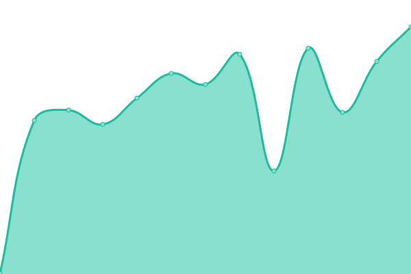
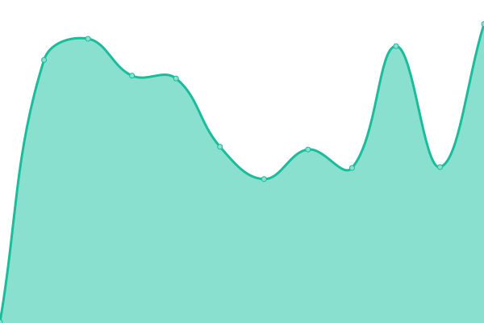
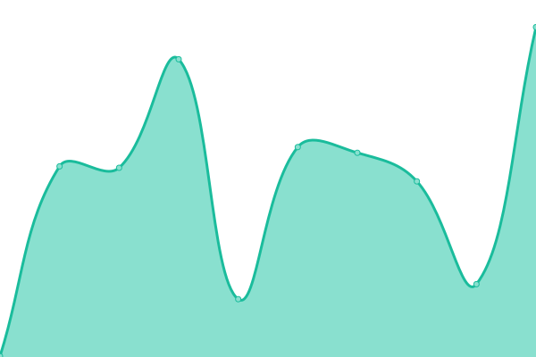

# Zosia Status

Monitoring Zosia public services.

[**→ health.zosia.io**](https://health.zosia.io)

<!--start: status pages-->
<!-- This summary is generated by Upptime (https://github.com/upptime/upptime) -->
<!-- Do not edit this manually, your changes will be overwritten -->
<!-- prettier-ignore -->
| URL | Status | History | Response Time | Uptime |
| --- | ------ | ------- | ------------- | ------ |
|  [Fact Check](https://fact-check.info) | 🟩 Up | [fact-check.yml](https://github.com/epheterson/upptime/commits/HEAD/history/fact-check.yml) | 

 479ms
     
 | 

<a href="https://health.zosia.io/history/fact-check">90.42%</a>
    

|  [Zosia Tools](https://tools.zosia.io) | 🟥 Down | [zosia-tools.yml](https://github.com/epheterson/upptime/commits/HEAD/history/zosia-tools.yml) | 

 306ms
     
 | 

<a href="https://health.zosia.io/history/zosia-tools">91.04%</a>
    

|  [Zosia Paste](https://paste.zosia.io) | 🟥 Down | [zosia-paste.yml](https://github.com/epheterson/upptime/commits/HEAD/history/zosia-paste.yml) | 

 253ms
     
 | 

<a href="https://health.zosia.io/history/zosia-paste">91.78%</a>
    

|  [Zosia Link Shortener](https://at.zosia.io) | 🟩 Up | [zosia-link-shortener.yml](https://github.com/epheterson/upptime/commits/HEAD/history/zosia-link-shortener.yml) | 

 253ms
     
 | 

<a href="https://health.zosia.io/history/zosia-link-shortener">91.78%</a>
    

|  [Zosia API](https://api.zosia.io/api) | 🟩 Up | [zosia-api.yml](https://github.com/epheterson/upptime/commits/HEAD/history/zosia-api.yml) | 

 248ms
     
 | 

<a href="https://health.zosia.io/history/zosia-api">91.77%</a>
    

<!--end: status pages-->
